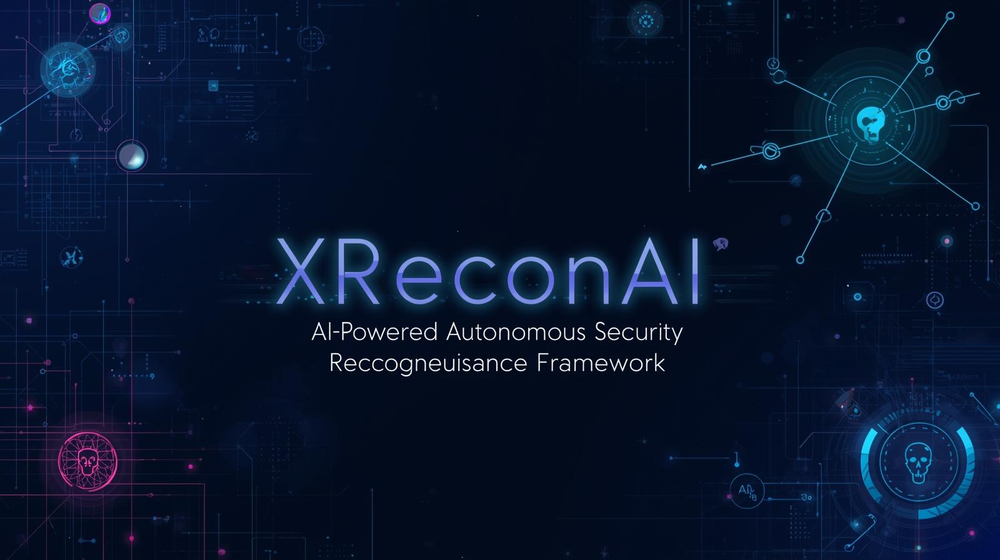

<p align="center">
  
</p>

# 🔍 XReconAI

**AI-Powered Autonomous Security Reconnaissance & Analysis Framework**


## 🚀 Overview

**XReconAI** is an **AI-first, autonomous security reconnaissance and analysis framework** designed for **authorized bug bounty hunters, security researchers, and defensive teams**.

It combines traditional reconnaissance and vulnerability analysis techniques with **advanced LLM-based reasoning** to:

* Reduce false positives
* Prioritize real-world security risks
* Generate **clear, human-readable, professional security reports**

> ⚠️ XReconAI is designed strictly for **authorized and ethical security testing only**.


## ✨ Key Features

### 🧠 AI-Driven Intelligence (Core Highlight)

* Multi-stage AI reasoning (not single-prompt analysis)
* False-positive filtering using contextual reasoning
* Exploitability & real-world feasibility assessment
* Business impact analysis
* CWE & OWASP Top 10 mapping
* Confidence-based validation before reporting


### 🛡️ Legal & Ethical by Design

* Mandatory scope validation
* Passive-only reconnaissance by default
* Automatic out-of-scope detection and abort
* Explicit legal and ethical guardrails

### 🔍 Reconnaissance Capabilities

* Passive DNS & subdomain enumeration
* HTTP header and technology fingerprinting
* `robots.txt` and `security.txt` discovery
* TLS / SSL configuration review


### ⚔️ Vulnerability Analysis (Controlled)

* Detection support for:

  * XSS
  * SQL Injection
  * IDOR
  * Open Redirects
* Endpoint and parameter discovery
* Rate-limited and depth-controlled scanning


### 📊 Risk & Severity Scoring

* Hybrid **CVSS + AI-assisted scoring**
* Priority ranking (P1–P4)
* Confidence-aware severity decisions
* Fix urgency estimation


### 📝 Professional Report Generation

* Bug bounty–ready report format
* Executive summary
* Technical details with evidence
* Impact explanation
* Remediation & defensive insights
* Export formats:

  * Markdown
  * PDF (optional)


### 🔁 Automation Ready

* GitHub Actions integration
* Scheduled scans
* Artifact storage
* AI-generated summaries for results


## 🏗️ Architecture Overview

XReconAI follows a **modular, AI-centric pipeline**:

```
Target Input
   ↓
Scope & Legal Validator
   ↓
Passive Recon Engine
   ↓
Active Scan Engine (Optional)
   ↓
Vulnerability Correlator
   ↓
AI Analysis Engine
   ↓
Risk & Severity Scoring
   ↓
Report Generator
```

Each stage is **isolated, configurable, and extensible**.


## ⚙️ Configuration

XReconAI uses an intelligent `config.yaml` to control runtime behavior:

* Bug bounty vs research mode
* Passive-only safety
* AI reasoning strictness
* Scan throttling
* Report style & confidence threshold

### Example

```yaml
project:
  mode: bugbounty
  passive_only: true

ai:
  reasoning_mode: conservative
  confidence_threshold:
    report_only_if_above: 65
```


## 🧠 AI Reasoning Pipeline (Detailed)

XReconAI uses a **multi-stage LLM pipeline** that mimics how an experienced security researcher thinks:

1. Finding normalization
2. False-positive filtering
3. Exploitability analysis
4. Business impact reasoning
5. Risk and severity scoring
6. Defensive insight generation
7. Professional report writing

> This approach focuses on **analysis and reasoning**, not blind scanning.


## 🛡️ Legal & Ethical Usage

XReconAI **MUST only be used** on:

* Assets you own, or
* Assets explicitly authorized under a bug bounty or security program

🚫 The tool will:

* Abort on out-of-scope targets
* Refuse ambiguous or illegal usage
* Avoid live exploit payload generation

The user is fully responsible for compliance with all applicable laws and program rules.


## 📦 Installation

```bash
git clone https://github.com/Fuadulislam10/XReconAI.git
cd XReconAI
pip install -r requirements.txt
```

*(Optional Docker support available.)*


## ▶️ Usage

```bash
python main.py --config config.yaml
```
Basic (default: passive-only)
```bash
python main.py
```
Use a custom config
```bash
python main.py --config config.yaml
```
Run on a different target (override config target)
```bash
python main.py --target example.com
```
Force passive-only mode (recommended for bug bounty)
```bash
python main.py --target example.com --passive-only
```
Enable active scan (ONLY if authorized)
```bash
python main.py --target example.com --no-passive-only --active
```
Change AI confidence threshold
```bash
python main.py --target example.com --confidence 70
```

✅ FAQ (Add to README)
❓ Why is the banner image not showing?

Make sure the image file exists in the repo and the path matches:

xreconai-banner.png (recommended in repo root)

❓ Tool aborts immediately

Your target is likely out of scope. Check:

scope.txt

config.yaml -> target.out_of_scope

❓ No findings in report

Possible reasons:

Only informational items found

AI confidence threshold is too high (try --confidence 55)

❓ Active scanning doesn’t run

You must set:
```yaml
--no-passive-only --active
or in config:

project:
  passive_only: false
scan:
  active:
    enabled: true
```

✅ Recommended Commit Message
Feat: add CLI flags for target, passive/active mode, and confidence threshold
Ensure scope is properly defined before execution.


## 🧪 Use Cases

* Bug bounty reconnaissance
* Security research & learning
* Defensive security analysis
* AI-assisted vulnerability triage
* Security report automation


## 🗺️ Roadmap

* Web UI dashboard
* Plugin-based recon modules
* Bugcrowd & custom report templates
* Team collaboration support
* SaaS-ready architecture


## 🤝 Contributing

Contributions are welcome:

* Add new recon modules
* Improve AI reasoning prompts
* Enhance reporting formats
* Improve documentation

Please follow ethical security guidelines.


## 📜 License

Released for **educational and authorized security research purposes only**.


## ⭐ Final Note

**XReconAI is not just a scanner —
it is an AI-assisted security reasoning framework.**

If you like this project, consider starring ⭐ the repository.
